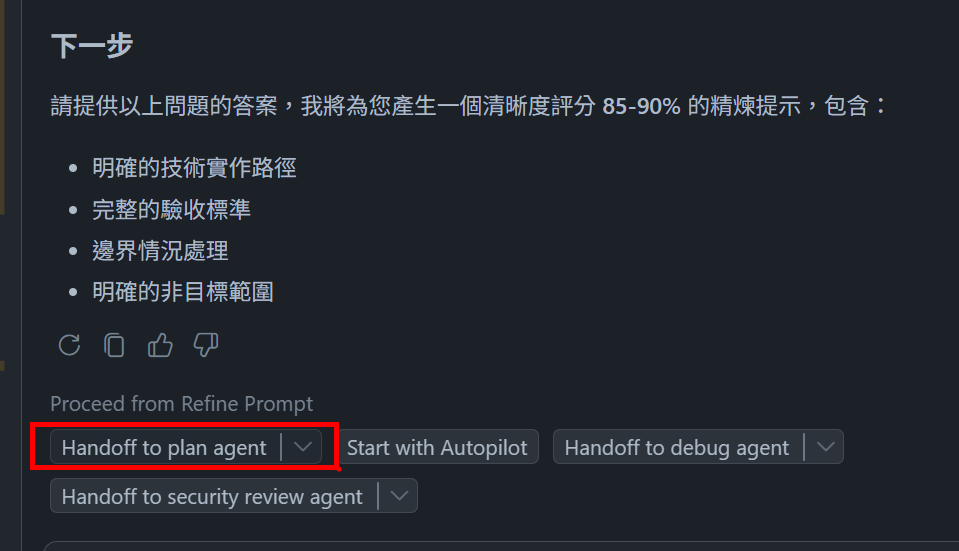
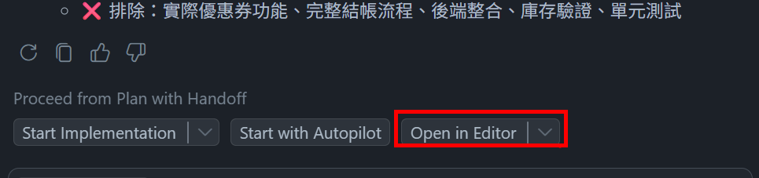

# 🚀 GitHub Copilot Hands-on Lab
## 🛠️ 開發工具中的 GitHub Copilot Workshop
- 模型選擇建議: **Claude Sonnet 4.5**

### 🧩 Lab 1 : 調整 custom instructions
- **示範重點：** 示範如何設定並驗證 GitHub Copilot 的客製化指示
- **目的：** 透過新增通用與語言特定指示，確保 Copilot 依需求回應並提供在地化註解
- **操作方式：**
    1. 開啟 GitHub Copilot Chat 任一模式，嘗試進行詢問
    2. 開啟 [copilot-instructions.md](../.github/copilot-instructions.md)，加入指定的回應語言區段
       ```
        ## GitHub Copilot Instructions
        - Must respond in Tranditional Chinese.
        - Do not execute commands or scripts in the terminal when using Agent Mode. 
       ```
    4. 再次進行詢問，確認回應語言是否依指示更新
    5. 新增 `instructions/python.instructions.md`，填入以下內容：
        ```
        ---
        applyTo: "api/**/*.py"
        ---
        ## Python Guidelines
        - All generated comments, always use Traditional Chinese and append "Generated by GitHub Copilot" at the end of each comment.
        ```
    6. 清空先前的對話輸入 `add comment for each line in #main.py `，查看生成結果
    7. 再次清空先前對話，輸入 `add comment for #App.tsx`，查看生成結果

---       

### ⚙️ Lab 2 : 利用 prompt file 盤點程式碼現況
- **示範重點：** 說明如何透過 Prompt 盤點程式碼現況
- **目的：** 導引使用者以 prompt file 的方式，協助盤點程式碼現況並提供相關建議
- **操作方式：**
    1. 開啟 `.github/system-inventory.prompt.md` 並閱讀內文
    2. 啟動 GitHub Copilot Chat，選擇 **Agent** 與 **Claude Sonnet 4.5**
    3. 在現有對話中執行 **Run prompt in current chat**
    4. 查看生成之盤點文件及優化建議

---

### 🎯 Lab 3 : 透過 Custom Agent 套用於規劃階段
#### 生成 Feature 及 User Story
- **示範重點：** 熟悉 Custom Agent 使用於規劃階段
- **目的：** 利用 Copilot Chat 的 Requirement Analyst 模式，從需求文件中提取並整理成 User Story，為後續的任務分解和測試案例生成做好準備
- **操作方式：**  
  1. 開啟 Copilot Chat，切換至 `Requirement Analyst` 模式
  2. 輸入 prompt `將 #requirement.md 進行分析並整理成 user-story.md 並儲存於 planning/ 下`

#### 產生工作任務
- **示範重點：** 熟悉 Custom Agent 使用於規劃階段
- **目的：** 透過 Copilot Chat 的 Requirement Analyst 模式，從已生成的 User Story 中提取任務，並整理成 Task 文件，為後續的開發和測試提供明確的指引
- **操作方式：**  
  1. 在同一個對話中，同樣保留在 `Requirement Analyst` 模式
  2. 輸入 prompt `根據 #user-story.md 生成 task.md，一樣儲存於 planning 下`

#### 依據 User Story 生成測試案例
- **示範重點：** 熟悉 Custom Agent 使用於規劃階段
- **目的：** 運用 Test Case Analyst 模式，從 User Story 中提取測試需求，並生成對應的測試案例文件，確保開發過程中的質量控制和驗收標準的明確性
- **操作方式：**  
  1. 於同一個對話中，切換至 `Test Case Analyst` 模式
  2. 輸入 prompt `根據 #user-story.md 生成 test-case.md，儲存於 planning 下`


---

### ✨ Lab 4 : 透過 Custom Agent 套用於實作計畫階段
#### 利用 Refine Prompt agent 進行提示詞優化
- **示範重點：** 使用專屬 agent 來改進提示，並提供清晰度評分
- **目的：** 幫助使用者釐清提示是取得好結果的關鍵，而多數開發者不知道如何改善提示此自訂聊天模式可協助提升提示品質
- **操作方式：**
    1. 在 Chat 模式選擇 **RefinePrompt**
    2. 輸入模糊的提示：`我需要購物車頁面` 輸出應包含追問與低清晰度分數
    3. 將 [cart image](../docs/design/cart.png) 附加到 Chat
    4. 輸入較完整的提示
       ```
       我需要購物車頁面，依附圖的設計元素顯示目前購物車內的商品，並支援深色/淺色模式。
       顯示 25 美元的運費，但當訂單金額超過 150 美元時提供免運費。
       在導覽列新增購物車圖示，能即時顯示購物車內的商品數量並於新增或移除商品時更新，點擊圖示時導向購物車頁面。
       ```
    6. 你應可看到更佳的提示與較高的清晰度評分

#### 利用 Plan agent 產生實作文件
- **示範重點：** 使用專屬 agent 來撰寫實作文件
- **目的：** 幫助使用者產生實作文件進行後續功能實作需求之釐清
- **操作方式：**
    1. 在既有的 session 中選擇 `Plan` chat mode
    2. 輸入以下 prompt
        ```
        我需要購物車頁面，依附圖的設計元素顯示目前購物車內的商品，並支援深色/淺色模式。
        顯示 25 美元的運費，但當訂單金額超過 150 美元時提供免運費。
        在導覽列新增購物車圖示，能即時顯示購物車內的商品數量並於新增或移除商品時更新，點擊圖示時導向購物車頁面。
        將這些更動計畫新增至新的檔案 planning/implement.md 中
        ```
    3. 查看生成之 `implement.md` 文件

---

### 🔄 Lab 5 : 使用 Handoff 機制串連不同的 Agent 來完成複雜任務
- **示範重點：** 使用專屬 agent 來改進提示，並提供清晰度評分，同時了解 handoff 機制如何串連不同的 custom agent
- **目的：** 幫助使用者釐清提示是取得好結果的關鍵，而多數開發者不知道如何改善提示此自訂聊天模式可協助提升提示品質
- **操作方式：**
    1. 在 Chat 模式選擇 **RefinePrompt**
    2. 將 [cart image](../docs/design/cart.png) 附加到 Chat
    3. 輸入較完整的提示
       ```
       我需要購物車頁面，依附圖的設計元素顯示目前購物車內的商品，並支援深色/淺色模式。
       顯示 25 美元的運費，但當訂單金額超過 150 美元時提供免運費。
       在導覽列新增購物車圖示，能即時顯示購物車內的商品數量並於新增或移除商品時更新，點擊圖示時導向購物車頁面。
       ```
    4. 執行完成後，點選下方 `Hadnoff to plan agent` 的按鈕，確認產出的實作計畫草稿內容是否符合預期

        
    5. 待 plan 階段完成後，點選 `open_in_editor` 的按鈕，確認產出的實作文件內容是否符

        

<!-- ## 將 Plan Agent 調整為具有 handoff 功能的 Custom Agent
- **示範重點：** 示範如何實作具有 handoff 的 Custom Agent
- **目的：** 讓使用者了解 Custom Agent 的基本架構與實作
- **操作方式：**
    1. 開啟 `.github/agents/plan-agent.yaml`，將內容替換為以下內容
       ```
        ---
        name: 'Plan'
        description: 'Plan changes to the codebase without changing any code.'
        tools: ['edit/createFile', 'edit/createDirectory', 'edit/editFiles', 'azure-mcp/search', 'search/usages', 'search/changes', 'web/fetch', 'web/githubRepo']
        handoffs:
        - label: Draft Implementation Plan
        agent: agent
        prompt: '#createFile the plan as is into an untitled file (`untitled:plan-${camelCaseName}.prompt.md` without frontmatter) for further refinement.'
        ---
       ```
    2. 修改完成後，重新啟動 GitHub Copilot Chat，選擇 `Plan` chat mode，輸入 prompt，測試 agent 是否能根據需求產出實作計畫草稿
        ```
        我需要購物車頁面，依附圖的設計元素顯示目前購物車內的商品，並支援深色/淺色模式。
        顯示 25 美元的運費，但當訂單金額超過 150 美元時提供免運費。
        在導覽列新增購物車圖示，能即時顯示購物車內的商品數量並於新增或移除商品時更新，點擊圖示時導向購物車頁面。
        ``` -->


<!-- #### 改用預設 Plan agent 產生實作文件
- **示範重點：** 使用預設 plan agent 進行功能規畫
- **目的：** 幫助使用者產生實作文件進行後續功能實作需求之釐清
- **操作方式：**
    1. 在新的 session 中選擇系統預設提供之 `Plan` chat mode
    2. 輸入以下 prompt
        ```
        我需要購物車頁面，依附圖的設計元素顯示目前購物車內的商品，並支援深色/淺色模式。
        顯示 25 美元的運費，但當訂單金額超過 150 美元時提供免運費。
        在導覽列新增購物車圖示，能即時顯示購物車內的商品數量並於新增或移除商品時更新，點擊圖示時導向購物車頁面。
        ```
    3. 透過問答協助釐清規格
    
       
    4. 等待實作計畫完成後，點選 Open in Editor
       
       
    5. 查看實作計畫並點選 Keep > Save As Prompt File，確認已生成 prompt 文件 -->
