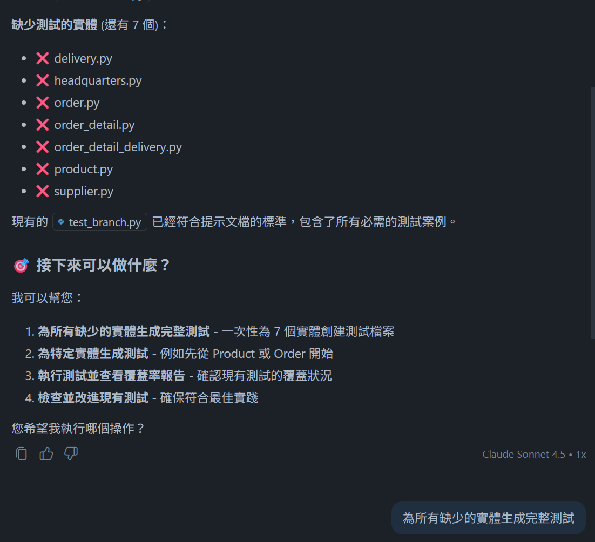

# 🚀 GitHub Copilot Hands-on Lab
## 🛠️ 開發工具中的 GitHub Copilot Workshop
- 模型選擇建議: **Claude Sonnet 4.5**

### 🤖 Lab 4 : 實作階段：使用 Agent 模式實作功能
#### 利用既有 prompt file 進行功能實作
- **示範重點：** 利用既有的 prompt file 在 Agent Mode 進行功能實作並驗證
- **目的：** 加速規劃功能的快速實作並獲得測試
- **操作方式：**
    1. 建立新分支 `cart-page-custom`，並切換到該分支開始實作
    2. 選擇 `Agent` chat mode
    3. 將購物車圖片 attach 到對話框中
    4. 開啟 [cart-page.prompt.md](../.github/prompts/cart-page.prompt.md) 檔案，點選右上角的 Run prompt in current chat 可開始實作購物車功能

#### 利用 plan mode 下生成之 prompt 進行功能實作
- **示範重點：** 利用 Plan Mode 生成的 prompt file 進行功能實作並驗證
- **目的：** 加速規劃功能的快速實作並獲得測試
- **操作方式：**
    1. 切換回 `main` 再建立新分支 `cart-page-plan`，並切換到該分支開始實作
    2. 選擇 `Agent` chat mode
    3. 將購物車圖片 attach 到對話框中
    4. 在 chat 中切換至 Agent Mode 並輸入 `/<prompt-file-name>`開始執行實作

---

### 🧑‍💻 Lab 5 : 實作單元測試
- **示範重點：** 利用 prompt file 實作單元測試並達成覆蓋率目標
- **目的：** 透過 prompt file 協助開發重複性工作
- **操作方式：**
    1. 切換到 `cart-page-plan` 分支，選擇 `Agent` chat mode，並輸入 `/pytest-unit-test` 開始生成測試案例
    2. 查看執行結果，並輸入 `為所有缺少的實體生成完整測試`

        
    3. 查看生成的測試案例，並執行測試及查看測試覆蓋率

---

### 🔍 Lab 6 : 利用 GitHub Copilot 進行 code review
- **示範重點：** 示範如何結合 Git 流程啟動 Copilot Code Review
- **目的：** 確保程式變更已整理並交付給 Copilot 進行自動化審查
- **操作方式：**
    1. 透過 VS Code 介面開啟 Source Control 視窗
    2. 點選 comit 欄位上方的 **Copilot Code Review**，逐步檢視建議，可選擇：
        - Code Review - Unstaged Change
        - Code Review - Staged Change