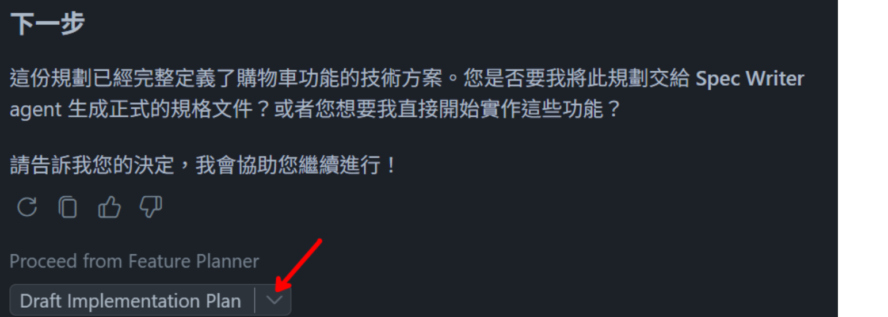

# 🚀 GitHub Copilot Hands-on Lab
## 開發工具中的 GitHub Copilot Workshop - 規劃階段
- 模型選擇建議: **Claude Sonnet 4.5**

### 🎯 Lab 8 : 生成 Feature 及 User Story
- **示範重點：** 熟悉 Custom Agent 使用於規劃階段
- **目的：** 利用 Copilot Chat 的 Requirement Analyst 模式，從需求文件中提取並整理成 User Story，為後續的任務分解和測試案例生成做好準備
- **操作方式：**  
  1. 開啟 Copilot Chat，切換至 `Requirement Analyst` 模式
  2. 輸入 prompt `將 #file:requirement.md 進行分析並整理成 user-story.md 並儲存於 planning/ 下`

---

### 🔐 Lab 9 : 產生工作任務
#### 
- **示範重點：** 熟悉 Custom Agent 使用於規劃階段
- **目的：** 透過 Copilot Chat 的 Requirement Analyst 模式，從已生成的 User Story 中提取任務，並整理成 Task 文件，為後續的開發和測試提供明確的指引
- **操作方式：**  
  1. 在同一個對話中，同樣保留在 `Requirement Analyst` 模式
  2. 輸入 prompt `根據 #file:user-story.md 生成 task.md，一樣儲存於 planning 下`

---

### 🧪 Lab 10 : 依據 User Story 生成測試案例
#### 
- **示範重點：** 熟悉 Custom Agent 使用於規劃階段
- **目的：** 運用 Test Case Analyst 模式，從 User Story 中提取測試需求，並生成對應的測試案例文件，確保開發過程中的質量控制和驗收標準的明確性
- **操作方式：**  
  1. 於同一個對話中，切換至 `Test Case Analyst` 模式
  2. 輸入 prompt `根據 #file:user-story.md 生成 test-case.md，儲存於 planning 下`

---

### 🤖 Lab 11 : Sub Agent 使用示範
- **示範重點：** 熟悉 Custom Agent 中的 sub agent 使用於規劃階段
- **目的：** 利用 custom agent 中的 sub agent 功能，將需求分析、任務生成和測試案例生成的流程於同一個對話中串接起來，實現從需求文件到 User Story、再到 Task 和 Test Case 的全流程自動化，提升規劃階段的效率和準確性
- **操作方式：**  
  1. 將先前生成的檔案全部移除，以避免對 sub agent 的測試造成干擾
  2. 開啟 Copilot Chat，切換至 `Recursive Processor` 模式
  3. 輸入 prompt `/recursive`

---

### 🛠️ Lab 12 : 製作自己的第一隻 Custom Agent

- **示範重點：** 示範如何實作具有 handoff 的 Custom Agent
- **目的：** 讓使用者了解 Custom Agent 的基本架構與實作
- **操作方式：**
  1. 開啟 Copilot Chat，切換至 `Agent` 模式，輸入以下提示詞
      ```
      /create-agent 建立一個提供開發者做功能開發前的規劃 agent，此 agent 完成規劃後會 hand-off 給使用者一個實作計畫的草稿，讓使用者可以將此草稿進行修改後交給實作 agent 進行開發
      ```
  2. 調整 handoffs 內文
      ```
        handoffs:
        - label: Draft Implementation Plan
          agent: agent
          prompt: '#createFile the plan as is into an untitled file (`untitled:plan-${camelCaseName}.prompt.md` without frontmatter) for further refinement.'
      ```
  3. 選擇剛剛建立的 agent，輸入 prompt，測試 agent 是否能根據需求產出實作計畫草稿
      ```
      我需要購物車頁面，依附圖的設計元素顯示目前購物車內的商品，並支援深色/淺色模式。

      顯示 25 美元的運費，但當訂單金額超過 150 美元時提供免運費。
      在導覽列新增購物車圖示，能即時顯示購物車內的商品數量並於新增或移除商品時更新，點擊圖示時導向購物車頁面。
      ```
  4. 點選 `Draft Implementation Plan` 的 handoff，確認產出的實作計畫草稿內容是否符合預期
  